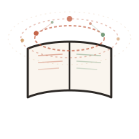
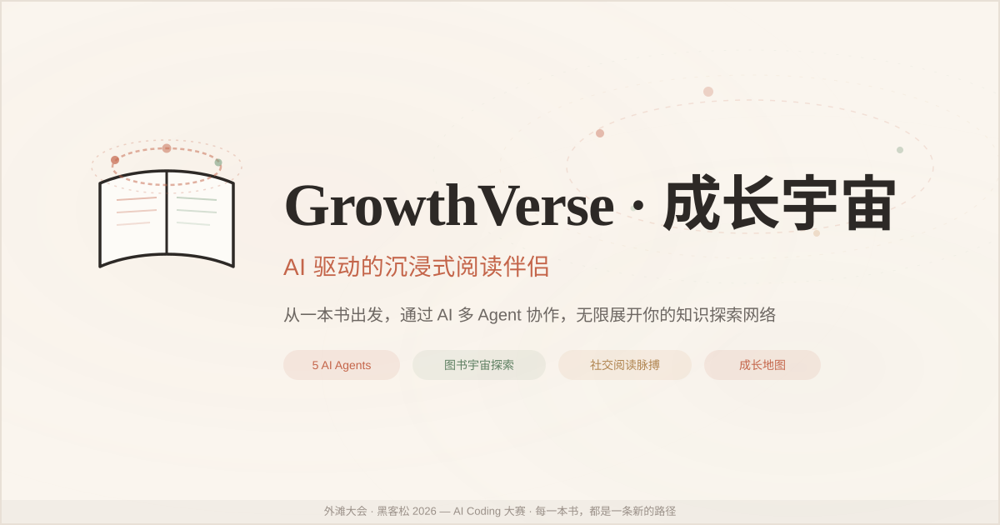

<div align="center">



# 📖 GrowthVerse · 成长宇宙

### AI 驱动的沉浸式阅读伴侣

**从一本书出发，通过 AI 多 Agent 协作，无限展开你的知识探索网络。**

[演示流程](#演示流程) · [快速开始](#快速开始) · [技术架构](#技术架构) · [架构文档](docs/architecture.md)

</div>

---

<!-- 社交分享卡片（1200x630） -->
<p align="center">
  
</p>

## ✨ 项目简介

**GrowthVerse**是一个以读书为核心驱动力的 AI 个人成长平台。在信息碎片化的时代，深度阅读依然是最高效的认知升级路径——但传统阅读缺乏即时反馈、社交连接和个性化引导。GrowthVerse用 AI 填补了这个缺口：**不只帮你找书，而是陪你读、帮你想、让你看到自己的成长轨迹。**

> 🏆 参加 **外滩大会 · 黑客松 2026 — AI Coding 大赛**，使用 **Qoder** 平台完成开发。

---

## 🚀 核心功能

- 💬 **AI 读书对话** — 和 AI 书友"小径"自然聊天，提到任何书名自动弹出精美可点击书卡片，AI 实时调用工具获取真实图书数据
- 📚 **图书宇宙递归探索** — 独创 Book Universe 交互范式，从一本书沿同作者/同主题/同时代三条维度递归展开，探索路径实时可视化为冒险地图
- ✍️ **读后反思引擎** — AI 引导三层深度反思：感知层 → 关联层 → 行动层，反思结果自动映射到六大成长维度
- 🎁 **每日读书盲盒** — 每天打开都有惊喜：书摘、阅读挑战、推荐好书、思考问题，拆盒动画 + 轻量互动，培养每日阅读仪式感
- 🧩 **阅读性格测验** — 12 道精心设计的问题，分析你的阅读人格类型，生成个性化分享卡片
- 🗺️ **成长地图** — 六维成长可视化（自我认知/情商/职业/关系/健康/哲学），探索路径时间线 + AI 洞察阅读模式
- 📊 **成长仪表盘** — 阅读统计 + 成长概览，追踪你的阅读轨迹和成长变化

---

## 🏗️ 技术架构

### 技术栈

| 层级 | 技术选型 | 说明 |
|:-----|:---------|:-----|
| **前端框架** | Next.js 15 + React 19 + TypeScript | App Router, Server Components, Streaming |
| **UI** | Tailwind CSS 4 + 自定义组件 | 暖色调 Terrace 设计语言，Framer Motion 动效 |
| **状态管理** | Zustand 5 | 轻量、高性能的客户端状态 |
| **AI 引擎** | Vercel AI SDK 7 + OpenAI | streamText + Tool-Use 模式，多 Agent 编排 |
| **数据存储** | Zustand + localStorage | 当前运行时在浏览器本地保存探索、反思与设置；仓库另附可选 Supabase schema |
| **图表** | Recharts 3 | 成长维度雷达图、阅读趋势图 |
| **图书数据** | Google Books API + 豆瓣读书 | 双源聚合，豆瓣优先，Google 回退 |

### AI Agent 架构

```
                    ┌─────────────┐
                    │   用户消息    │
                    └──────┬──────┘
                           ▼
                  ┌────────────────┐
                  │  🧭 Core 编排者  │  ← 意图识别 + 上下文管理
                  │  (Orchestrator) │
                  └───┬───┬───┬────┘
                      │   │   │
          ┌───────────┘   │   └───────────┐
          ▼               ▼               ▼
  ┌──────────────┐ ┌──────────────┐
  │ 📚 Atlas     │ │ 💭 Echo      │
  │ 读书教练      │ │ 反思伙伴      │
  │              │ │              │
  │ · 个性化推荐  │ │ · 三层引导    │
  │ · 难度递进    │ │ · 维度映射    │
  │ · 场景适配    │ │ · 行动闭环    │
  └──────────────┘ └──────────────┘
                                      │
                                      ▼
                              ┌──────────────┐
                              │ 🔮 Prism     │
                              │ 成长洞察师    │
                              │              │
                              │ · 旅程叙事    │
                              │ · 知识脉络    │
                              │ · 模式发现    │
                              └──────────────┘

  ── 工具层 (Tool-Use) ──
  ┌──────────────┐ ┌──────────────┐
  │ search_books │ │get_book_dtl  │
  │ 图书搜索      │ │ 图书详情      │
  └──────────────┘ └──────────────┘
```

**4 个 Agent 分工**：

| Agent | 角色 | 核心能力 |
|:------|:-----|:---------|
| 🧭 **Core** | 编排器 | 意图路由、上下文管理、工具调度 |
| 📚 **Atlas** | 读书教练 | 个性化推荐、难度递进、场景适配 |
| 💭 **Echo** | 反思伙伴 | 三层反思引导、成长维度映射、行动闭环 |
| 🔮 **Prism** | 成长洞察 | 探索旅程叙事、知识脉络图谱、阅读模式发现 |

### 数据源

| 数据源 | 用途 | 接入方式 |
|:-------|:-----|:---------|
| **Google Books API** | 图书搜索与详情 | REST API，无需 Key（基础用量） |
| **豆瓣读书** | 中文图书核心数据 | 基于 MIT 开源项目 `acdzh/douban-book-api` 的本地适配服务 |
| **浏览器本地存储** | 探索路径、反思记录、设置 | Zustand 持久化到 localStorage |
| **Supabase schema（可选）** | 后续服务端持久化基础 | 仓库提供 12 表迁移脚本，当前业务运行时尚未接入 |

---

## 🏁 快速开始

### 环境要求

- **Node.js** >= 22
- **npm** >= 10

### 安装步骤

```bash
# 1. 进入项目目录
cd bund-hackathon

# 2. 安装依赖
npm ci

# 3. 配置环境变量
cp .env.example .env.local
# 可选：编辑 .env.local，填入真实 AI / 图书 / 社交数据源配置

# 4. 启动开发服务器
npm run dev
```

访问 **http://localhost:3000** 即可体验。

### 环境变量配置

| 变量 | 必填 | 说明 |
|:-----|:----:|:-----|
| `OPENAI_API_KEY` | ❌ | 启用真实 AI 生成；未配置时使用可操作的本地阅读伙伴回复 |
| `NEXT_PUBLIC_SUPABASE_URL` | ❌ | 预留的 Supabase 项目 URL；当前业务数据仍保存在浏览器本地 |
| `NEXT_PUBLIC_SUPABASE_ANON_KEY` | ❌ | 预留的 Supabase 匿名 Key |
| `DOUBAN_API_URL` | ❌ | 豆瓣读书 API 地址，默认 `http://localhost:3900` |

> 当前探索路径、反思记录和设置使用 `localStorage`，清理浏览器数据会一并删除。`supabase/migrations/` 是后续服务端持久化的 schema 基础，并不代表当前运行时已经连接数据库。

---

## 📁 项目结构

```
bund-hackathon/
├── src/
│   ├── agents/              # 🤖 多 Agent 系统
│   │   ├── orchestrator.ts  #    Core 编排器入口
│   │   ├── prompts/         #    4 个 Agent 的 System Prompt
│   │   │   ├── orchestrator.ts  # 🧭 Core — 意图路由
│   │   │   ├── atlas.ts         # 📚 Atlas — 读书教练
│   │   │   ├── echo.ts          # 💭 Echo — 反思伙伴
│   │   │   └── prism.ts         # 🔮 Prism — 成长洞察师
│   │   └── tools/           #    Agent 工具（Tool-Use）
│   │       └── book-tools.ts    # 图书搜索 + 详情
│   ├── app/                 # 📄 Next.js 页面
│   │   ├── (main)/chat/     #    AI 对话页
│   │   ├── explore/         #    图书宇宙探索
│   │   ├── dashboard/       #    成长仪表盘
│   │   ├── reflection/      #    读后反思
│   │   ├── daily-box/       #    每日盲盒
│   │   ├── quiz/            #    阅读性格测验
│   │   ├── map/             #    成长地图
│   │   └── api/v1/          #    API Routes（9 个端点）
│   ├── components/          # 🧩 UI 组件
│   ├── stores/              # 📦 Zustand 状态管理（4 个 Store）
│   ├── types/               # 📐 TypeScript 类型定义
│   ├── data/                # 📊 种子数据
│   └── lib/                 # 🔧 工具库 + 外部 API 客户端
├── douban-book-api/         # 📚 豆瓣读书 API 独立服务（基于 MIT 上游适配）
├── supabase/migrations/     # 🗄️ 可选数据库 schema（当前运行时未接入）
├── docs/                    # 📝 文档
├── assets/                  # 🖼️ 截图和封面
└── presentation/            # 🎬 演示材料
```

---

## 🎬 演示流程

仓库提供可直接照着录制的 [演示脚本](presentation/demo-script.md)，不使用未发布的占位视频链接。

1. **AI 对话** — 和“小径”聊天，提到书名自动弹出书卡片
2. **图书宇宙** — 从《三体》出发，递归探索科幻文学网络
3. **读后反思** — AI 引导三层深度反思，映射成长维度
4. **成长地图** — 查看六维成长可视化和探索路径

---

## 💡 创新亮点

### 三大核心创新

1. **图书宇宙递归探索** — 独创的 Book Universe 交互范式，每次点击都是一次知识发现。从一本书出发，沿三个维度无限展开，探索路径实时可视化为冒险地图。这不是传统的“相关推荐”，而是一个完整的知识探索体验。

2. **AI 多 Agent 协作架构** — 4 位专门化 AI Agent 各司其职，通过 Tool-Use 模式协同工作。不是简单的“一个 AI 做所有事”，而是每个 Agent 在自己的领域做到极致。这种架构让 AI 的每次回复都更专业、更有深度。

### 技术亮点

- **流式响应 + Tool-Use** — 基于 Vercel AI SDK 7，AI 回复流式传输，工具调用实时可见
- **双源图书数据聚合** — 豆瓣 + Google Books 并行搜索，智能去重，优雅降级
- **书名实体识别** — AI 回复中的 `[[书名]]` 自动渲染为可点击书卡片
- **优雅降级策略** — 外部 API 不可用时自动降级为 mock 数据，保证功能完整可用

---

## 🏆 参赛信息

| 项目 | 内容 |
|:-----|:-----|
| **赛事** | 外滩大会 · 黑客松 2026 — AI Coding 大赛 |
| **开发平台** | Qoder |
| **赛道** | AI Coding 全民赛道 |
| **开发周期** | 2026.07.20 — 2026.08.09 |

### 评审维度对应

| 评审维度 | 权重 | GrowthVerse的亮点 |
|:---------|:----:|:----------|
| 💡 **技术创新性** | 40% | 4 Agent 协作架构 + Tool-Use 模式 + 递归交互范式 |
| ✅ **项目完整度** | 30% | 7 个功能页面 + 浏览器本地持久化 + 可选 12 表数据库 schema + 4 个 Agent Prompt |
| 📈 **商业潜力** | 20% | 千亿图书市场 + 可复制的 Agent 架构 |
| 🎬 **演示效果** | 10% | 2-3 分钟精炼演示 + 完整脚本 + 核心功能全覆盖 |

---

## 🙏 致谢

- **外滩大会 · 黑客松 2026** — 提供这次精彩的 AI Coding 竞赛机会
- **Qoder** — 强大的 AI 编程平台，让创意快速变为现实
- **Vercel AI SDK** — 优秀的 AI 集成框架，让多 Agent 协作变得优雅
- **豆瓣读书 / Google Books** — 丰富的图书数据支撑

---

## 📄 License

本项目为黑客松参赛作品，仅供评审和展示用途。`douban-book-api/` 保留其上游版权声明并按目录内 [MIT License](douban-book-api/LICENSE) 使用。

---

<div align="center">

**📖 GrowthVerse — 每一本书，都是一条新的路径**

*用 AI 重新定义阅读，用数据记录成长*

</div>
