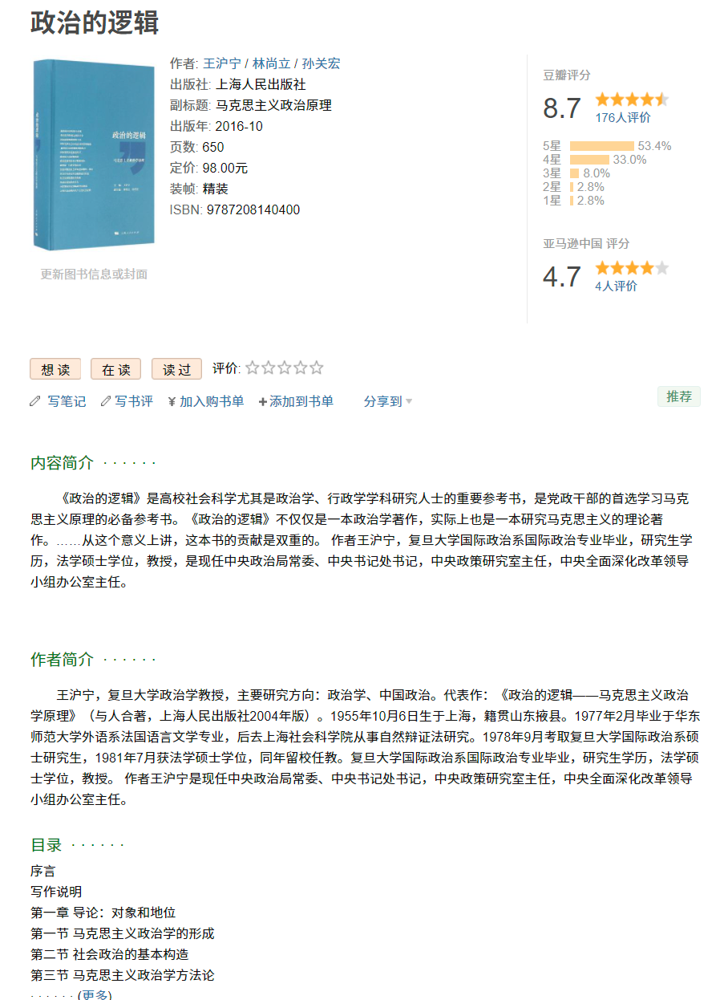

# Douban Book API

## 简介

这是一个使用网页解析实现的第三方豆瓣读书 API。本目录改编自 [acdzh/douban-book-api](https://github.com/acdzh/douban-book-api)，上游版权与 MIT 许可见 [LICENSE](LICENSE)；GrowthVerse 仅对其做本地端口、搜索结果兼容和解析健壮性适配。

服务本身不包含豆瓣数据，需要自行运行并遵守豆瓣网站的使用规则。网页解析可能触发风控或因页面结构变化失效，请控制请求频率。本仓库不提供或宣称一个可用的公共演示实例。

## 安装

要求 Node.js 22 或更高版本。

### 使用 Docker

```bash
docker build -t growthverse-douban-api .
docker run -d \
  --name growthverse-douban-api \
  -p 3900:3900 \
  -v /CACHE_DIR:/cache \
  growthverse-douban-api
```

### 使用 Node.js

```bash
npm ci
npm start
```

默认监听 `http://localhost:3900/`，可通过 `PORT` 环境变量覆盖。访问 `/ping` 应返回 `pong`。

## API 接口说明

### 图书搜索接口

#### 请求地址  

`{HOST}/search?text=<text>`  

#### 请求方式  

**GET**  

#### 请求参数  

##### Header 参数  

| 参数名          | 必选  | 类型/参数值           | 说明     |
|--------------|-----|------------------|--------|
| Content-Type | 是   | application/json | 请求参数类型 |

#### 返回示例

`{HOST}/search?text=刘慈欣`

```json
{
  "success": true,
  "data": [
    {
      "title": "三体 : “地球往事”三部曲之一",
      "id": "2567698",
      "url": "https://book.douban.com/subject/2567698/",
      "cover": "https://img1.doubanio.com/view/subject/m/public/s2768378.jpg",
      "rating": "8.8",
      "rating_count": 410716,
      "info": "刘慈欣 / 重庆出版社 / 2008-1 / 23.00"
    }
  ],
  "is_cache": false
}
```

#### 备注

仅返回豆瓣图书条目并标准化为上面的七个字段；当前搜索未实现分页。

### 根据豆瓣 id 或 isbn 获取图书详情

#### 请求地址  

`{HOST}/subject/<id>`  
`{HOST}/isbn/<isbn>`

#### 请求方式  

**GET**  

#### 请求参数  

##### Header 参数  

| 参数名          | 必选  | 类型/参数值           | 说明     |
|--------------|-----|------------------|--------|
| Content-Type | 是   | application/json | 请求参数类型 |

#### 返回示例

`{HOST}/subject/27012117`  
`{HOST}/isbn/9787208140400`

```json
{
  "success": true,
  "data": {
    "title": "政治的逻辑",
    "subtitle": "马克思主义政治原理",
    "original_title": "",
    "id": "27012117",
    "isbn": "9787208140400",
    "author": ["王沪宁", "林尚立","孙关宏"],
    "translator": [],
    "publish": "上海人民出版社",
    "producer": "",
    "publishDate": "2016-10",
    "pages": "650",
    "price": "98.00元",
    "binding": "精装",
    "series": "",
    "book_intro": "《政治的逻辑》是高校社会科学....",
    "author_intro": "王沪宁，复旦大学政治学教授...",
    "catalog": ["序言", "......", "后记"],
    "original_texts": ["阶级消亡...", "国家是..."],
    "labels": ["政治学", "马克思主义", "王沪宁", "政治", "政治经济学", "马克思", "中国", "社会学"],
    "cover_url": "https://img2.doubanio.com/view/subject/l/public/s29602841.jpg",
    "url": "https://book.douban.com/subject/27012117/",
    "rating": {
      "count": 176,
      "info": "",
      "value": 8.7,
      "five_star_per": 53.4,
      "four_star_per": 33,
      "three_star_per": 8,
      "two_star_per": 2.8,
      "one_star_per": 2.8
    },
    "comments": [{
      "vote": 1,
      "user_name": "乔治 ♘",
      "user_page": "https://www.douban.com/people/165208204/",
      "rating": 4,
      "date": "2021-04-07",
      "content": "中国马克思主义的集大成..."
      }],
    "reviews": [{
      "user_avatar": "https://img1.doubanio.com/icon/u1566359-9.jpg",
      "user_name": "月之仙者",
      "user_page": "https://www.douban.com/people/yuezhixianzhe/",
      "rating": 3,
      "time": "2008-08-06 09:53:30",
      "publisher": "上海人民出版社2004版",
      "publisher_page": "https://book.douban.com/subject/1003659/",
      "title": "政治的逻辑：马克思主义政治学原理",
      "url": "https://book.douban.com/review/1463309/",
      "short_content": "经过十天左右的时间终于看完了...",
      "useful_count": 53,
      "useless_count": 2,
      "reply_count": 8
    }],
    "notes": []
  },
  "is_cache": false
}
```

这个返回的结果对应 [https://book.douban.com/subject/27012117/](https://book.douban.com/subject/27012117/) 或者 [https://book.douban.com/isbn/9787208140400/](https://book.douban.com/isbn/9787208140400/), 见下图: 



#### 数据格式

| 首级标签           | 次级标签   | 三级标签     | 名称                                                              | 类型                                                                 | 示例  | 备注  |
|----------------|--------|----------|-----------------------------------------------------------------|--------------------------------------------------------------------|-----|-----|
| title          ||| 标题     | string   | "政治的逻辑"                                                         ||
| subtitle       ||| 副标题    | string   | "马克思主义政治原理"                                                     ||
| original_title ||| 原标题    | string   || 适用于译著                                                           |
| id             ||| 豆瓣 id  | string   | "27012117"                                                      ||
| author         ||| 作者     | string[] | ["王沪宁", "林尚立", "孙关宏"]                                           | 顺序与豆瓣页面一致, 不进行排序                                                   |
| translator     ||| 译者     | string[] | []                                                              | 顺序与豆瓣页面一致, 不进行排序                                                   |
| publish        ||| 出版社    | string   | "上海人民出版社"                                                       ||
| producer       ||| 出品方    | string   | ""                                                              ||
| publishDate    ||| 出版年    | string   | "2016-10"                                                       ||
| pages          ||| 页数     | string   | "650"                                                           ||
| price          ||| 定价     | string   | "98.00元"                                                        ||
| binding        ||| 装帧     | string   | "精装"                                                            ||
| series         ||| 丛书     | string   | ""                                                              ||
| book_intro     ||| 内容简介   | string   | "《政治的逻辑》是.."                                                    ||
| author_intro   ||| 作者简介   | string   | "王沪宁，复旦大学..."                                                   ||
| catalog        ||| 目录     | string[] | ["序言", "..."]                                                   ||
| original_texts ||| 原文摘录   | string[] | ["阶级消亡..."]                                                     ||
| labels         ||| 标签     | string[] | ["政治学","马克思主义"]                                                 ||
| cover_url      ||| 封面地址   | string   | "https://img2.doubanio.com/view/subject/l/public/s29602841.jpg" |  |
| url            ||| 豆瓣页面地址 | string   | "https://book.douban.com/subject/27012117/"                     | [政治的逻辑 (豆瓣)](https://book.douban.com/subject/27012117/)            |
| rating         ||| 豆瓣评分   | object   |||
|| count          || 评分人数   | number   | 176                                                             ||
|| info           || 评分信息   | "" \     | "目前无人评价" \                                                      | "评价人数不足"                                                           |""|当评分不足时, 此项不为空|
|| value          || 分数     | number   | 8.7                                                             ||
|| five_star_per  || 五星占比   | number   | 53.4                                                            | 百分数                                                                |
|| four_star_per  || 四星占比   | number   | 33                                                              | 百分数                                                                |
|| three_star_per || 三星占比   | number   | 8                                                               | 百分数                                                                |
|| two_star_per   || 二星占比   | number   | 2.8                                                             | 百分数                                                                |
|| one_star_per   || 一行占比   | number   | 2.8                                                             | 百分数                                                                |
| comments       ||| 短评     | object[] || 该项为数组, 包括最新短评与热门短评, 短评有字数限制                                     |
|| vote           || 有用数    | number   | 1                                                               ||
|| user_name      || 用户昵称   | string   | "乔治 ♘"                                                          ||
|| user_page      || 用户主页   | string   | "https://www.douban.com/people/165208204/"                      | [乔治 ♘](https://www.douban.com/people/165208204/)                   |
|| rating         || 评分     | number   | 4                                                               ||
|| date           || 日期     | string   | "2021-04-07"                                                    ||
|| content        || 内容     | string   | "中国马克思主义..."                                                    ||
| reviews        ||| 书评     | object[] || 此项为数组, 包含热门书评与最新书评                                              |
|| user_avatar    || 用户头像   | string   | "https://img2.doubanio.com/icon/u176380444-1.jpg"               |                |
|| user_name      || 用户昵称   | string   | "东风一号"                                                          ||
|| user_page      || 用户主页   | string   | "https://www.douban.com/people/176380444/"                      | [东风一号](https://www.douban.com/people/176380444/)                   |
|| rating         || 评分     | number   | 4                                                               ||
|| time           || 日期     | string   | "2018-04-27 00:35:23"                                           ||
|| publisher      || 版本     | string   | "上海人民出版社2004版"                                                  | 同一本书不同版本下的书评, 如果该项为空, 则说明用户所读的是当前版本                                |
|| publisher_page || 对应版本页面 | string   | "https://book.douban.com/subject/1003659/"                      | [政治的逻辑 (豆瓣)](https://book.douban.com/subject/1003659/)             |
|| title          || 标题     | string   | "王沪宁《政治的逻辑》读后感"                                                 ||
|| url            || 书评链接   | string   | "https://book.douban.com/review/9320713/"                       | [王沪宁《政治的逻辑》读后感（政治的逻辑）书评](https://book.douban.com/review/9320713/)  |
|| short_content  || 书评摘要   | string   | "花了十几天的时间终于..."                                                 ||
|| useful_count   || 有用数    | number   | 16                                                              ||
|| useless_count  || 没用数    | number   | 1                                                               ||
|| reply_count    || 回应数    | number   | 2                                                               ||
| notes          ||| 读书笔记   | object[] || 开发中...                                                          |
| discussion     ||| 论坛     | object[] || 开发中...                                                          |

## 缓存

查询会强制写缓存. 缓存文件夹路径由环境变量 `CACHE_DIR` 决定, 缺省情况下是 `./.cache`, docker 中该路径为 `/cache`. 缓存存于这个文件夹下的 `books.sqlite` 中.

默认会先从缓存中查询, 如果需要最新数据可以指定 api 参数 `update=1`.

## Calibre 插件

打包 `calibre` 目录为 zip, 拖入 Calibre 安装即可. 注意需要在设置里更改为自己的 api 地址.

## 油猴脚本

[自动刷新豆瓣图书 api 缓存 @Greasy Fork](https://greasyfork.org/zh-CN/scripts/431582)

这个脚本可以在浏览豆瓣时自动提交图书信息. 第一次使用需要先设置 api 服务器地址.

## 其他

因为是通过抓取 html 页面来获取数据, 因此抓取较慢且有一定概率遭到反爬测率限制或数据解析失败. 如果解析规则失效或解析数据有误, 请提 issure 或 pr, 谢谢茄子🍆.

请确保 issure 中包含以下信息:

 - 你遇到的问题.
 - 测试用例. 最好是豆瓣图书链接.

如果要提 pr, 请在提供上述信息的同时, 另外确保所有测试用例没有问题. 可以使用 `npm run test` 来运行测试.
